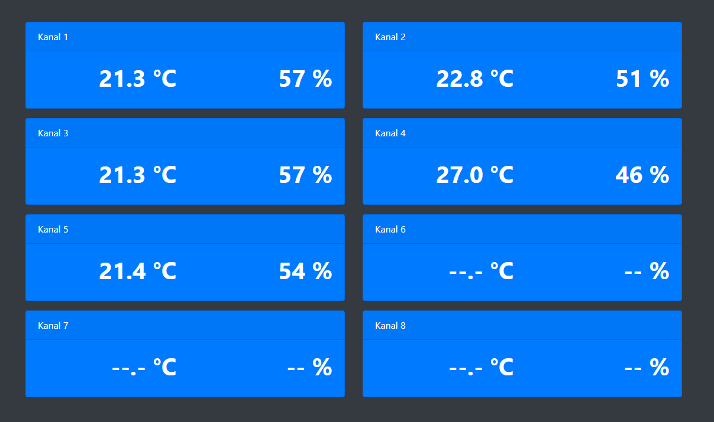

# Web-Anzeige für Raumklimastation RS 500

Grundlegendes Projekt: [https://github.com/juergen-rocks/raumklima](https://github.com/juergen-rocks/raumklima) (Backend etc.)
Beschreibung und Installation: [https://juergen.rocks/art/elv-raumklimastation-rs500-webinterface.html](https://juergen.rocks/art/elv-raumklimastation-rs500-webinterface.html)

